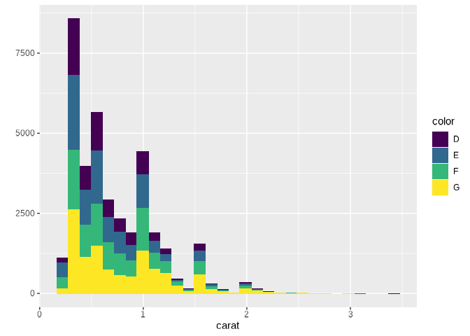
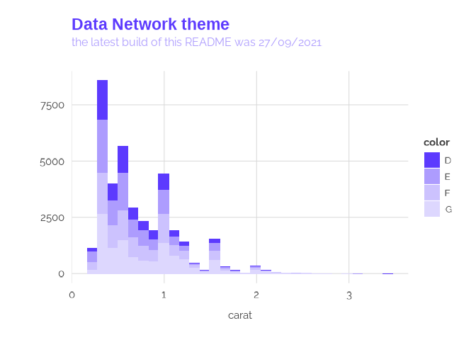
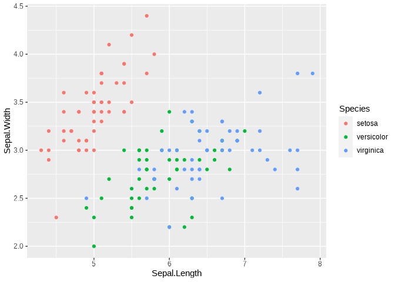
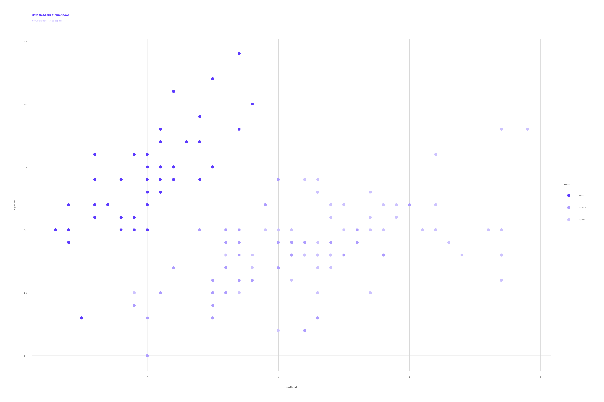

<!-- README.md is generated from README.Rmd. Please edit that file -->

# dntheme

<!-- badges: start -->

<!-- badges: end -->

This repo contains the functions of the `dntheme` package, which once installed locally, provides helpful functions for creating and exporting graphics made in ggplot in the style used by the Data Network associates & projects.

## Installation :hammer:

`dnthemes` is not on CRAN, so you will have to install it directly from Github using devtools. You can install the development version from [GitHub](https://github.com/) with:

``` r
install.packages("devtools")
devtools::install_github("Data-Network-Lab/DN_theme")
```

## Use `dntheme` :pill:

The package automagically :mage: imports (via `showtext`) the **Raleway** Google font ([Raleway, sans-serif](https://fonts.google.com/specimen/Raleway))

``` r
library(dntheme)

d <- qplot(carat, data = diamonds[diamonds$color %in%LETTERS[4:7], ], geom = "histogram", bins=30, fill = color)
d
```



Tech themes and scales:

``` r
d + theme_dn() + 
  scale_fill_dn() + 
  labs(title="Data Network theme", 
       subtitle="the latest build of this README was 27/09/2021")
```



Data Network color scales:

``` r
data("iris")

d1 <- qplot(x  = Sepal.Length, y =Sepal.Width,colour = Species,data = iris,geom = "point")
d1
```



``` r
d1 + theme_dn() + 
  scale_color_dn() + 
  labs(title="Data Network theme tooo!", 
       subtitle="wow, iris species  are so popular")
```



DN_geoms, inspired by [emoGG](https://github.com/dill/emoGG).

``` r
d2 <- data.frame(x = c(1:4, 3:1), y=1:7)
```

``` r
plot = ggplot(aes(x,y), data=d2) + 
  geom_dn(size=1.5, theme="google") + 
  theme_dn() +
  labs(
    x = "",
    y = "")

add_dn_titles(
    plot,
    title = "Let's have this logos up here",
    subtitle = "they look fun")
```

<!-- ```{r, eval=FALSE} -->

<!-- ggplot(aes(x,y), data=d2) +  -->

<!--   geom_tech(size=0.15, theme="etsy") +  -->

<!--   theme_tech("etsy")+ -->

<!--   ggtitle("Etsy geom") -->

<!-- ``` -->

## Data Network Palette :rainbow:


## License

[(Back to top)](#table-of-contents)

Please visit the LICENSE.md file.

<!-- Add the footer here -->


